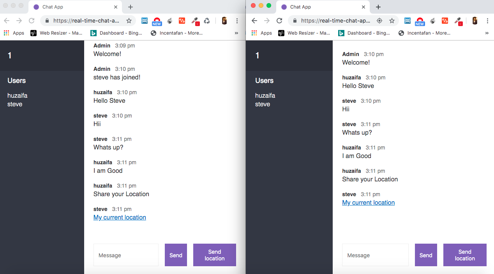
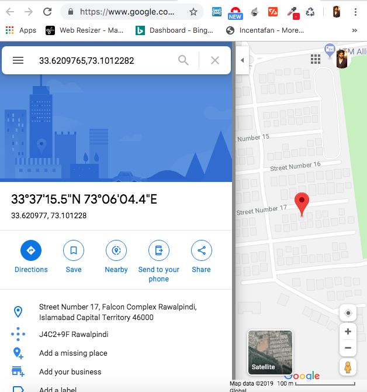

# chat-app-with-node-js-and-socket.io-and-user-location-sharing-as-well
This is a real time chat app build in node-js using express as middle-ware and Socket.io is used for real time notifications. It has also a feature that user can share their location with each other.

Live Web App Link: https://real-time-chat-app-huzaifa8580.herokuapp.com/

1) Download project
2) Open terminal and enter npm install
3) npm start
4) open browser and enter localhost:3000 
5) Enter your Display name and a room no
6) Open another broswer and open localhost:3000 and add another user eg Steve but add the same room no.
7) now add the user with same room no can chat with each other.
8) for security and privacy reasons we do not save the messages when the session is terminated all the data is deleted.  

The project will be live on port 3000 

Project Screen Shots 

Chat Room with huzaifa and Steve.

When user click on location sent from other user.

